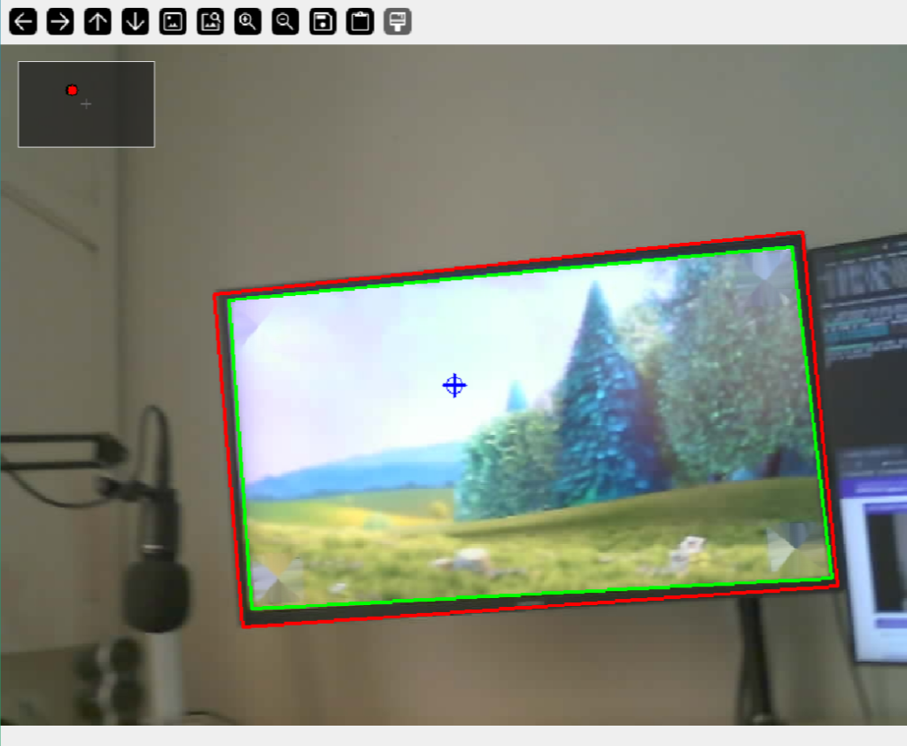
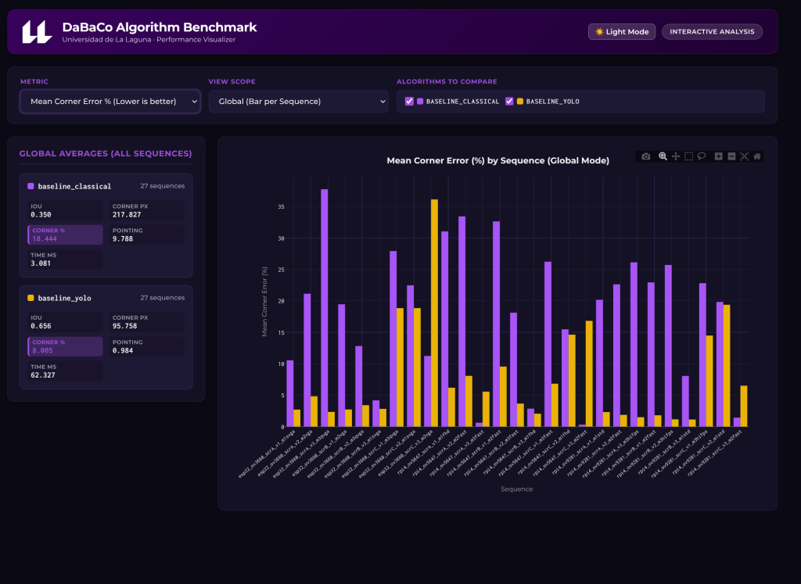

# DABACO Dataset Toolkit


This repository contains the official toolkit for accessing, evaluating, and benchmarking screen detection and pointing algorithms on the **DABACO Dataset** (*Dispositivo Apuntador de BAjo COste*).

> **Dataset Download**: The dataset is hosted on Zenodo: [10.5281/zenodo.22797836](https://doi.org/10.5281/zenodo.22797836)

---

## Directory Structure

- `python/access/`: Dataloaders to easily iterate over camera sequences and annotations.
- `python/metrics/`: Standardized evaluation metrics (`Detection Rate`, `Corner Error (px/%)`, `IoU`, `Pointing Error`, `Jitter`) comparing algorithm predictions against ground truth.
- `python/algorithms/`: Screen detection algorithms and baseline models:
  - `baseline_classical.py`: Advanced classical computer vision pipeline (bilateral filtering, multi-scale Canny edge maps, adaptive thresholding, convexity & aspect ratio scoring).
  - `baseline_yolo.py`: Deep learning instance segmentation detector using YOLO.
  - `evaluate_algorithm.py`: Main evaluation script computing frame-by-frame and aggregate metrics with an interactive virtual HUD visualizer.
- `python/tools/`:
  - `compare_algorithms.py`: Standalone interactive HTML benchmark generator (with Dark/Light themes, official ULL corporate palette, and Plotly charts).
- `results/`: Directory where per-sequence evaluation JSON reports are saved.

---

## Getting Started

### Prerequisites & Installation

- **Python Version**: Python `>= 3.9` (Reference environment: `3.14.7`, pinned in `.python-version` for `pyenv`/`uv`/`asdf`).

Clone the repository and set up a Python virtual environment:

```bash
cd python
python3 -m venv .venv
source .venv/bin/activate

# Standard installation (compatible version ranges)
pip install -r requirements.txt

# Or exact reproducible freeze
pip install -r requirements-lock.txt
```

---

## Evaluating Algorithms

Run the evaluation script on an extracted dataset folder. You can evaluate all sequences or target a specific one with `--sequence`:

```bash
# Evaluate baseline_classical on a dataset directory
python algorithms/evaluate_algorithm.py /path/to/dataset --algorithm baseline_classical

# Evaluate baseline_yolo with live HUD visualization
python algorithms/evaluate_algorithm.py /path/to/dataset --algorithm baseline_yolo --visualize

# Evaluate a specific sequence
python algorithms/evaluate_algorithm.py /path/to/dataset --algorithm baseline_classical --sequence esp32_ov3660_scrA_v1_m1svga
```

### Interactive Visualization (HUD) Controls



When running with `--visualize`:
- **Green Bounding Box**: Ground truth screen corners.
- **Red Bounding Box**: Predicted screen corners.
- **Blue Reticle / Crosshair**: Camera optical center (frame center).
- **Virtual Screen Mini-HUD (Top-Left)**: Displays the pointing coordinate relative to the screen frame (Green dot: Ground truth, Red dot: Prediction).
- **Keyboard Shortcuts**:
  - `Space` / Any key: Step to the next frame.
  - `Q` / `q`: Exit visualization.

Evaluation results are automatically exported to `results/<algorithm_name>/<sequence_name>.json`.

---

## Benchmark & Comparison Dashboard



📊 **[Open Live Interactive Benchmark](https://domondo.github.io/dabaco-dataset-toolkit/)** *(via GitHub Pages)*  
*(Alternative direct mirror: [RawGithack Live Mirror](https://raw.githack.com/DoMondo/dabaco-dataset-toolkit/main/docs/index.html))*

To regenerate or compare newly evaluated algorithms (e.g. `baseline_classical` vs. `baseline_yolo`) locally across all sequences:

```bash
# Generates docs/index.html (GitHub Pages) by default
python tools/compare_algorithms.py --results_dir results
```

Open `compare_results.html` in your browser.

### Features of the Comparison Tool:
- **Interactive Metric Selection**: Filter by `Mean IoU`, `Corner Error (px)`, `Corner Error (%)`, `Pointing Error`, or `Inference Time (ms)`.
- **Global & Sequence Views**:
  - **Global Mode**: Compare sequence-level bars grouped by algorithm + global average overview cards.
  - **Sequence Mode**: Frame-by-frame bar chart with interactive range slider + sequence average overview cards.
- **Algorithm Filtering**: Real-time checkboxes to toggle algorithms in the comparison.
- **Corporate Styling**: Styled according to the **Universidad de La Laguna (ULL)** design system with automatic Dark / Light mode toggle.
