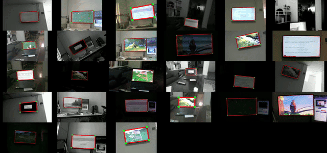

# DABACO Dataset Toolkit



This repository contains the official code for accessing and evaluating the DABACO Dataset (Dispositivo Apuntador de BAjo COste).

> **Dataset Download**: The dataset is hosted on Zenodo: [10.5281/zenodo.22797836](https://doi.org/10.5281/zenodo.22797836)

## Directory Structure

- `python/access/` and `matlab/access/`: Dataloaders for Python and Matlab/Octave to easily iterate over the dataset and its ground truth.
- `python/metrics/` and `matlab/metrics/`: Standardized evaluation metrics (`Detection Rate`, `Pixel Error`, `IoU`, `Jitter`) to compare algorithm predictions against the ground truth.
- `python/baselines/` and `matlab/baselines/`: Reference algorithms (like classical screen contour detection) and evaluation scripts.

## Getting Started

To begin working with the dataset, the easiest way is to run the provided baseline script. It demonstrates how to initialize the dataset, iterate over the video frames, and calculate the evaluation metrics using the ground truth.

### Python

Navigate to the `python` directory, create a virtual environment, and install the required dependencies:

```bash
cd python
python -m venv .venv
source .venv/bin/activate
pip install -r requirements.txt
```

Run the classical baseline on an extracted dataset folder:

```bash
python baselines/evaluate_baseline.py /path/to/extracted/dabaco_esp32_ov3660
```

### Matlab / Octave

Navigate to the `matlab` directory. If you prefer working in Matlab or GNU Octave, we provide a native object-oriented loader and metrics evaluator. You can test the baseline by running:

```matlab
% In Octave or Matlab CLI from the 'matlab' folder:
run('baselines/evaluate_baseline.m')
```
